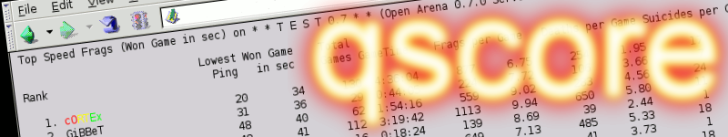
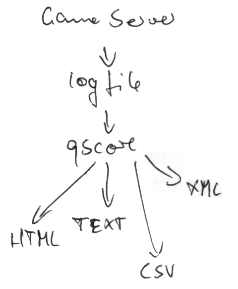

# qscore



Parse id Tech 3 (Quake III: Arena) games.log into high scores and statistics


## How does it work?




# Quake III version

since 1999 several "Point release" updates for Quake III: Arena had been released by id Software

They can be distinguished by their file suffix of demos, the protocol version or Point release version

    Demo file suffix    Protocol version    Point release version    Date of packaging (Linux)
    .dm3                                    1.05 Test                    May 10              1999
    .dm3                                    1.08 Test                    Aug  3              1999
    .dm3                43                  1.11 Demo                Mon Dec 13 19:43:57 PST 1999
    .dm3                43                  1.16n                        Mar 14              2000
    .dm_45              45                  1.17 Update              Fri Apr 28 10:19:02 PDT 2000
    .dm_45              45                  1.25 Update
    .dm_46              46                  1.26 Update
    .dm_48              48                  1.27g Update
    .dm_66              66                  1.29h-beta Update        Thu Aug  2 21:00:05 CEST 2001
    .dm_66              66                  1.30 Update              Thu Sep 27 23:04:51 CEST 2001
    .dm_67              67                  1.31 Update              Mon Dec 17 18:14:19 CET 2001
    .dm_68              68                  1.32 Update              Mon Oct  7 22:44:41 CEST 2002
    .dm_68              68                  1.32b Update             Thu Nov 14 04:47:25 CET 2002
    .dm_68              68                  1.32b-3 Update           Thu Oct  2 07:53:28 CDT 2003
    .dm_68              68                  1.32c Update                 May  8              2006


## Install

Run the following in the src directory

```./configure;make;make install```


## Usage

    qscore 0.8.3 Unix (Linux) 2007 by NoisyB
    This may be freely redistributed under the terms of the GNU Public License
    
    Usage: qscore [OPTION] LOGFILE
    
    Parse Quake III: Arena (and compatible) games.log into high scores and statistics
    
    id Tech 3 based games and mods
      --defrag      parse Defrag log
                      writes XML files with stats for every player and map
      --idt3        parse ID Tech 3 compatible log
      --q3          parse Quake III: Arena log
      --other       same as --idt3
    
    Options
      --nocache     disables use of cache files for the logs (default: enabled)
                      Cache files speed up parsing and high score generation a LOT
      --cols=COLS   output high scores and statistics (default: all);
                      COLS must be a colon-separated list with these values
                      1  Lowest Ping
                      2  Won Game in seconds (Speed Frag)
                      3  Total Game Time
                      4  Games
                      5  Frags
                      6  Deaths
                      7  Suicides
                      8  Frags per Hour/FPH
                      9  Frags per Game
                      10 Deaths per Game
                      11 Suicides per Game
                      12 Frags:Deaths Ratio (Skill factor)
                      13 How many Games won
                      14 Deaths and Suicides added together
                      15 Highest Ping
                      16 Efficiency (100 * Frags) / (Frags + Deaths)
                      17 Frags per Minute
                      18 Games won in percent (100 * Wins) / Games finished
                      19 CTF Total Scores (the same as Frags (5))
                      20 Defrag Fastest Run CPM (automatically set by --defrag
                      21 Defrag Fastest Run VQ3 (automatically set by --defrag
                      e.g. --cols=5:6:4 would output Frags, Deaths and Games
                      NOTE: Frag and Death values do not include Suicides
      --version     output version information and exit
      --help        display this help and exit
    
    Strip & Sort
      --top=N       show only the first N ranks
      --sname=NAME  strip player with NAME from the output
                      the name must be specified as shown in --raw output
      --sother=NAME strip all except player with NAME from the output
                      the name must be specified as shown in --raw output
      --ban=NAME    ban cheater with NAME from the output
                      the name must be specified as shown in --raw output
      --stotal      skip display of total scores
      --strip=FLAG  strip rows from the output who have...
                      FLAG=1  players with no frags
                      FLAG=2  players with only 1 (or less) Game played
                      FLAG=4  players with no Game won
                      FLAG=8  players with less than 10 Games played
                      FLAG=16 players with 0ms ping
                      FLAG=32 maps (do not show maps as players)
                      FLAG=64 players (show only maps)
                      It is possible to combine flags. FLAG=5 would strip
                      players with no frags and no Game won
      --sort=COLUMN sort output by COLUMN
       -r           sort reverse
    
    Output filter
       -o=FILE      output into FILE (default: stdout)
      --map-wise    output all high scores map-wise
      --html        output as html (default)
      --php         output as PHP code (array ())
      --raw         output as plain text with Quake color codes
      --txt         output as plain text
      --ansi        output as text with ANSI colors
      --csv[=SEPARATOR] output as comma-separated values CSV
      --xml         output as XML


## FAQ

Q: How do I enable logging?

A: If you run e.g. a Q3A (Quake3:Arena) server the games are logged into the
games.log file

You should set the cvar in your server configuration as follows

We recommend to use both cvar names if you're not sure which version
of the game server you have

    // Name: logfile
    // Default: "0"
    // Description: Console logging 0=no,1=buffered,2=continuous,3=append.
    set logfile "3"
    // Name: g_logSync (id Tech 3)
    //       g_logFileSync (ioQuake3)
    // Default: "0"
    // Description: Sync the logfile with the last write
    set g_logSync "1" 
    set g_logfileSync "1"
    // Name: g_log (id Tech 3)
    //       g_logfile (ioQuake3)
    // Default: "games.log"
    // Description: Name of the logfile
    set g_log "games.log"
    set g_logfile "games.log"

The games.log file should then be found in the baseq3 directory


Q: Is there another way to get a logfile from a running server?

A: With "tail -f"

```bash
./q3ded +set dedicated 2 +exec server.cfg 2> $(date +"/logs/%H@%d-%b-%y.log") 
tail -f /logs/14@01-Dec-06.log | cat
```


## external/

    qcon.php                rcon client


## Changes

0.0.1alpha
- very first release
- tested with OpenArena and seems to work

0.0.2alpha
- added --sort=HOW sort player results by frags, rounds, average
- added -r sort reverse
- added -o=FILE output into FILE (default: stdout)
- added --txt output as plain text (default)
- added --ansi output as text with ANSI colors
- added --csv output as comma-separated values CSV
- added --html output as html

0.0.3
- added --top=N show only the first N places
- added --snoob strip new players from the output
                  like those with negative frags or only 1 Game played
- added --sname=NAME  strip player with NAME from the output

0.0.4
- added  --raw output as plain text with proprietary ESC codes (default)
- rewrote the log parser and added some new high scores and statistics to the output
- added "Fastest Game" statistics
- added 4 new ways to sort the ranks

0.0.5
- added some contributions like complete htdocs written in PHP to display the scores online
- added some scripts that generate map rotations from a directory with pk3 files

0.0.6
- optimized the whole code a bit
- added Total Game Time statistics
- added a remote console for Quake3:Arena (and compatible) server administration

0.0.7
- fixed the bug in the txt and html output
- added FPH (Frags Per Hour) statistics

0.8.0
- qscore is at version 0.8.0 because many changes and code cleanups have taken place
    also some new tools have been added to this package
- added (qscore) Frags/Deaths ratio statistics
- added (qscore) Total Games won statistics
- added (qscore) Deaths + Suicides combined statistics
- added (qscore) Highest Ping statistics
- added (qscore) --idt3 parse ID Tech 3 compatible log
- added (qscore) --q3 parse Quake III: Arena log (default)
- added (qscore) --other parse ID Tech 3 compatible log
- added (qscore) --cols[=COLS] output high scores and statistics; COLS must
    be a colon-separated list with these values; --cols replaces --player
- changed (qscore) --sort=COLUMN sort works COLUMN-wise now
- added (qscore) a general --strip option and merged --server, --snoob, etc.
- updated (qscore) output as CSV option
- updated install instructions
- updated faq
- added (qscore) cache functionality for much faster parsing of log files
- added (qscore) --nocache disables use of cache files for the logs (default: enabled)
- added (qscore) --php output as PHP code (array ())
- added (qscore) example PHP code in contrib for use with qscore
- added (qscore) Games won in percent (100 * Wins) / Games finished
- added a new tool called qmaps for managing maps, creating indices with levelshots and
    lists of entities used in the maps
- added (qscore) --xml output as XML
- added (qmaps) --index output index of map(s) found in the PAK(S)|PK3(S) (default)
- added (qmaps) --rot output baseq3 style rotation for the map(s) in the PK3(S)
- added (qmaps) --rotxp output excessiveplus style rotation for the map(s) in the PK3(S)
- added (qmaps) --rename rename PAK|PK3 name to map name
- added (qmaps) --txt output as plain text (default)
- added (qmaps) --html output as (simple) html
- added (qmaps) --xml output as XML into current dir with map name as filename
- added (qmaps) example PHP code in contrib for use with qmaps
- added a new tool for (un)pak'ing id Tech 1 & 2 pak files
- added (pak) -l list PAK contents
- added (pak) -x extract PAK contents into current dir

0.8.1
- some code cleanups and minor changes
- updated (qmaps_php) the PHP code a bit, made it faster
- added example for a default game server installation to the contributions
- added (qmaps) --repack option to make maps independent from a game or map pack

0.8.2
- added (qscore) --sother=NAME strip all except player with NAME from the output
- added (qcon) fixed recognition of UDP timeouts
- added qmaster; qmaster uses the XML output of qstat (http://qstat.org) as a new master server or "proxy"
- added (qmaster) -e=PATTERN use PATTERN for matching server
- added (qmaster) -i ignore case distinctions
- added (qmaster) -v select non-matching servers
- changed (qscore) layout of XML output to reduce filesize

0.8.3rc1
- this is more of a test release, qscore 0.8.3 itself is still work in progress
- added (qmaps) --surface parse all textures and shaders in the PK3(S) and output
    them as XML for further use
- added (qmaps) --sql output as ANSI SQL script
- added (qscore) --defrag parse Defrag log and output fastest runs map-wise
- added (qscore) --cpma parse Challenge Pro Mode Arena log
- added (qscore) --list just list all players
- added (qscore) player-wise weapon stats
- added (qmaster) --port=PORT use different port (default: 27950)
- added (qmaster) --no-bots no bots
- added (qdemos) parse demos of id Tech 3 based games

0.8.3rc2
- fixed linking against not necessary libs
- fixed broken ANSI output of qdemos, qscore, etc.

0.8.3rc3uzu
- uZu (qdemos): output more infos from infostrings
- uZu (qdemos): added Defrag specific settings
- uZu (qdemos): changed format of the display
- uZu (qdemos): changed some output to be conditional (by mod, if set)
- uZu (idtech3): added "game.h" (Q3:A/TA and Defrag gametypes)

0.8.3
- the codebase of qmaps and qdemos has been merged into file2xml (http://file2xml.sf.net)
- qscore will not be continued in future (use vsp_stats or http://www.4shared.com/file/LvpOcmg4/pyqscore.html)

1.0beta
- merged qscore and qdemos and ported them to PHP and back to C
- qcon is trivial and has been moved to contrib/
- qmaps has been discontinued


## Legacy releases

#### qscore

Parse id Tech 3 (Quake III: Arena) games.log into high scores and statistics

Version: 0.8.3rc3uzu

Source: [qscore-0.8.3rc3uzu-src.zip](https://sourceforge.net/projects/qscore/files/qscore-0.8.3rc3uzu-src.zip/download)

Linux binary: [qscore-0.8.3rc3uzu-linux.tar.gz](https://sourceforge.net/projects/qscore/files/qscore-0.8.3rc3uzu-linux.tar.gz/download)


#### qcon

Remote console for Quake III: Arena (and compatible) server administration

Version: 0.8.3rc3uzu

Source: [qscore-0.8.3rc3uzu-src.zip](https://sourceforge.net/projects/qscore/files/qscore-0.8.3rc3uzu-src.zip/download) (shares its codebase with qscore)
    
Linux binary: [qscore-0.8.3rc3uzu-linux.tar.gz](https://sourceforge.net/projects/qscore/files/qscore-0.8.3rc3uzu-linux.tar.gz/download)
    

#### qdemos

Dump human readable demo contents from id Tech 3 based games (Quake III: Arena)
    
Version: 0.8.3rc3uzu
    
Source: [qscore-0.8.3rc3uzu-src.zip](https://sourceforge.net/projects/qscore/files/qscore-0.8.3rc3uzu-src.zip/download) (shares its codebase with qscore)
    
Linux binary: [qscore-0.8.3rc3uzu-linux.tar.gz](https://sourceforge.net/projects/qscore/files/qscore-0.8.3rc3uzu-linux.tar.gz/download)
    

#### qmaps
    
Map manager for Quake III: Arena (and compatible) maps
    
Version: 0.8.3rc3uzu
    
Source: [qscore-0.8.3rc3uzu-src.zip](https://sourceforge.net/projects/qscore/files/qscore-0.8.3rc3uzu-src.zip/download) (shares its codebase with qscore)
    
Linux binary: [qscore-0.8.3rc3uzu-linux.tar.gz](https://sourceforge.net/projects/qscore/files/qscore-0.8.3rc3uzu-linux.tar.gz/download)
    

#### qmaster
    
Private master server for Quake III: Arena (and compatible)
    
Current version: 0.8.3rc3uzu
    
Source: [qscore-0.8.3rc3uzu-src.zip](https://sourceforge.net/projects/qscore/files/qscore-0.8.3rc3uzu-src.zip/download) (shares its codebase with qscore)
    
Linux binary: [qscore-0.8.3rc3uzu-linux.tar.gz](https://sourceforge.net/projects/qscore/files/qscore-0.8.3rc3uzu-linux.tar.gz/download)
    

## Other log parsers

http://sourceforge.net/projects/multistat/

https://web.archive.org/web/20110313042612/http://www.scivox.net/vsp/

http://www.scivox.net/vsp/

https://web.archive.org/web/20090712004504/http://aeons.planetquake.gamespy.com/aestats/

http://aeons.planetquake.gamespy.com/aestats/

http://sysd.org/stas/node/21

http://cade.datamax.bg/away/ets/

http://members.iinet.net.au/~gards1/jackpp/

http://sourceforge.net/projects/jackpp/

https://github.com/czimnick/php_quake3_demoparser


## License

    qscore - Parse id Tech 3 (Quake III: Arena) games.log into high scores and statistics
    Copyright (C) 2007-2009 NoisyB  

    This program is free software; you can redistribute it and/or modify
    it under the terms of the GNU General Public License as published by
    the Free Software Foundation; either version 2 of the License, or
    (at your option) any later version.

    This program is distributed in the hope that it will be useful,
    but WITHOUT ANY WARRANTY; without even the implied warranty of
    MERCHANTABILITY or FITNESS FOR A PARTICULAR PURPOSE.  See the
    GNU General Public License for more details.

    You should have received a copy of the GNU General Public License
    along with this program; if not, write to the Free Software
    Foundation, Inc., 675 Mass Ave, Cambridge, MA 02139, USA.
